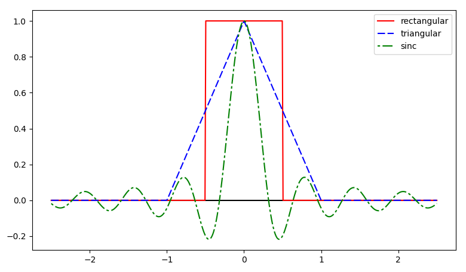

# global-illumination
`Global Illumination = “virtual photography”
Given a scene description that specifies the location of surfaces in a scene, the location of lights, and the location of a camera, take a virtual “photograph” of that scene.`

本项目作为课程设计内容实现了一个全局光照的渲染器，并结合代码讲解路径追踪算法的基本原理。

## 路径追踪算法的基本原理
路径追踪和光线追踪的基本思路是一样的，只不过我们需要在采样路径上多加考量，在项目中路径追踪主要是指蒙特卡洛路径追踪（Monte Carlo Path Tracing）
### 渲染方程
我们有如下渲染方程：

**方程含义**

1.$`L(P \rightarrow D_v)`$：计算从点$`P`$沿观察方向$`D_v`$的光亮度。\
2.$`L_e(P \rightarrow D_v)`$：如果$`P`$是光源，则直接贡献自发光。\
3.积分项：计算所有可能的入射光$`𝐷_𝑖`$对$`𝑃`$的贡献：
- BRDF($`F_s`$): 决定多少入射光被反射到$`Dv`$.
- $`(cosθ)`$: 入射角度越大，贡献越小（类似斜照光变暗）。
- 递归的$`L(Y_i\rightarrow -D_i)`$: 入射光本身可能是其他点的反射光（全局光照）。
### 蒙特卡洛积分
可以从渲染方程中看出，最关键的部分是在半球面上积分的部分，入射方向可以有无穷多个，并且该积分很难找到解析解，我们需要一种方法能够用有限次的计算近似替代无限的积分结果，这就需要用到统计学的知识。\
**蒙特卡洛积分公式**
```math
\int_a^b f(x)dx \approx \frac{1}{N} \sum_{k=1}^N \frac{f(X_k)}{p(X_k)}, \quad X_k \sim p(x)
```
其中：
- $`p(x)`$是采样概率密度函数(PDF)。
- $`X_k`$是从$`p(x)`$中抽取的随机样本。

将蒙特卡洛方法代入渲染方程的积分项：
```math
\int_{\Omega} F_s(D_v, D_i) |\cos \theta| L(Y_i \rightarrow -D_i) \, dD_i \approx \frac{1}{N} \sum_{k=1}^N \frac{F_s(D_v, D_i^{(k)}) |\cos \theta^{(k)}| L(Y_i^{(k)} \rightarrow -D_i^{(k)})}{p(D_i^{(k)})}
```
如果在半球面上均匀采样$`N`$次立体角$`D_i^{(k)}`$,我们有
```math
D_i^{(k)} \sim p(D_i^{(k)}) = \frac{1}{2\pi}
```
### 路径追踪的实现

跟据上面公式我们得到路径追踪的代码。
```
shade(p,Dv)
    Randomly choose N directons Di ~ pdf
    Lo = 0.0
    for each Di
        Trace a ray r(p,Di)
        //光源的光
        If ray r hit the light
            Lo +=(1/N) * L_i * f_r * cosine / pdf(Di)
        //碰到其他物体反射的光
        Else If ray r hit an object at q
        Lo +=(1/N) * shade(y,-wi) * L_i * f_r * cosine / pdf(Di)
```
上面代码有两个问题：\
1.如果每一次递归都打出 $`N`$ 条光线，那么递归 $`n`$ 次之后，光线一共膨胀成了$`n^{N}`$条，如果$`N>1`$，那么其呈指数增长趋势，这种计算量是爆炸的，唯一的解决方法是取$`N = 1`$，**即每次只取一条光线。**\
但是这就有问题了，本来是一个采样统计的方法，结果现在只取一条光线，那么结果肯定是不准确的。所以在这里就需要**在一个像素内进行多条路径采样**，将每条路径得到的结果按照一定方式取平均，得到最终该像素的亮度。\
算法如下，多了生成光线的过程，在一个像素中随机取$`N`$条路径，再代入$`shade(p,Di)`$计算，将$`N`$条路径得到的结果取平均作为该像素最终的值。
```
ray_generation(camPos, pixel)
    Uniformly choose N sample positions within the pixel
    pixel_radiance = 0.0
    For each sample in the pixel
        Shoot a ray r(camPos, cam_to_sample)
        If ray r hit the scene at p
            pixel_radiance += 1/N * shade(p,sample_to_cam)
    return pixel_radiance
```


2.在前面的 $`shade(p,Dv)`$中，我们并没有设置递归什么时候结束。虽然在现实中光线确实可以通过无限次弹射，但是在程序中我们需要考虑为其设置停止条件，这里用到的方法是俄罗斯轮盘赌，同样也是一个概率方法，它是说在每次递归中，生成一个随机数，如果该随机数小于我们设定的概率值，那么递归可以继续进行，否则就可以结束递归返回了。

最终我们的代码如下：
```
shade(p,Dv)
    Manually specify a probability P-RP
    Randomly select ksi in a uniform dist. in [0, 1]
    If(ksi > P_RR) return 0.0

    Randomly choose ONE directons Di ~ pdf
    Trace a ray r(p,Di)
    If ray r hit the light
        return L_i * f_r * cosin / pdf(Di) / P_RR
    Else If ray r hit an object at q
        return shade(y,-Di) * f_r * cosin / pdf(Di) / P_RR
```
### 伽马矫正
通过路径追踪算法计算得到的值为一系列没有边界的颜色值，我们需要将其转化为人眼能够感知到的亮度，将颜色值转入 0 到 255 之间，在这里使用的伽马值为 2.2，计算公式为$`c^{1/2.2}*255+0.5`$。
```c++
inline double clamp(double x) {
    return x < 0 ? 0 : x > 1 ? 1 : x;
}
inline int toInt(double x) { 
    return int(pow(clamp(x), 1 / 2.2) * 255 + 0.5); 
}
```
## 走样与反走样(aliasing/anti-aliasing)
图形信号是连续的，而用来显示的系统却是一个个离散的像素，这种用离散的量（像素）表示连续的量（几何线段、多边形等图形）而引起的失真，叫作走样（aliasing）。走样是数字化过程的必然产物。用于减少或消除走样的技术，称为反走样（anti-aliasing）。

### Super-Sampling Anti-Aliasing
反走样的方法有：

1.提高分辨率。SSAA（Super-Sampling Anti-Aliasing）\
2.非加权区域采样。MSAA（Multi-Sampling Anti-Aliasing）\
3.加权区域采样。

我们使用的是**超级采样（SSAA）**
```c++
for (int y = 0; y < H; y++) {
    for (int x = 0; x < W; x++) {
        Vec color = Vec(); // 初始化像素颜色
        for (int sy = 0; sy < 2; sy++) {       // 子像素行（2x2 超级采样）
            for (int sx = 0; sx < 2; sx++) {   // 子像素列
                Vec accumulated_color = Vec();
                for (int s = 0; s < samples; s++) {
                    // 在像素内随机采样（抗锯齿关键）
                    double r1 = 2 * rand(), r2 = 2 * rand();
                    double dx = r1 < 1 ? sqrt(r1) - 1 : 1 - sqrt(2 - r1);
                    double dy = r2 < 1 ? sqrt(r2) - 1 : 1 - sqrt(2 - r2);
                    Vec d = cx * (((sx + 0.5 + dx) / 2 + x) / W - 0.5) +
                            cy * (((sy + 0.5 + dy) / 2 + y) / H - 0.5) + cam.d;
                    accumulated_color += radiance(Ray(cam.o + d * 140, d.norm()), 0);
                }
                color += accumulated_color / samples;
            }
        }
        img[y * W + x] = color / 4; // 平均 4 个子像素
    }
}
```
我们将每个像素分成 4 个子像素，在子像素内进一步随机采样$`（dx, dy）`$，避免规则走样。通过 samples 次采样求平均，进一步平滑噪声和锯齿。

我们以每个像素的中心为原点，在其左右上下 1 个像素距离内采样。中央密集，边缘稀疏。或者说越靠近中央，贡献越大，采样的概率大。


### tent filter
我们并没有使用均匀采样，这是因为均匀采样样本可能过于聚集或稀疏，导致 方差（噪声）较大。在 Monte Carlo 积分中，高方差意味着需要更多样本才能收敛。\
*那我们该用什么样的方式来采样呢？*
- 理论上最好的antialiasing方法是sinc filter，因为sinc filter可以完美的去除所有高于Nyquist frequency的频率，并保留lower ones，所以我们的目标是尽可能的接近sinc filter的波形，以达到完美的antialiasing效果。


每个像素用一个三角形滤波函数是可以的，sma每个像素划又分成 2x2 的子像素，对每个子像素用上三角形滤波函数，然后取平均值，其结果相当于梯形滤波函数。

关于光线追踪的反走样方法大体有两种，不同之处在于权重发生的环节。一种是均匀采样，然后加权累加；一种是按密度概率函数采样，累加后求平均值。后者让中央得到采样的概率大，更密集些，但是坚持所有的采样一律平等原则，我们使用后者。

然后来讲解一下我们如何用代码来实现tent filter，也就是已知均匀分布函数 random()，如何生成指定的分布函数 f(x)。\
跟据概率论的知识，我们有：
1. 概率密度函数（PDF）
```math
p(x) = \frac{f(x)}{\int_{a}^{b} f(t) \, dt}
```
2. 累积分布函数（CDF）
```math
F(x) = \frac{\int_{a}^{x} f(t) \, dt}{\int_{a}^{b} f(t) \, dt} = \int_{a}^{x} p(t) \, dt
```
跟据逆变换采样（Inverse Transform Sampling）
```math
若  y = F(x)  严格单调递增，则：\\

x = F^{-1}(y), \quad y \in [0,1]
```

  1. 生成均匀随机数 $`y \sim U(0,1)`$。
  2. 计算   $`x = F^{-1}(y)`$ ，则  $`x `$ 服从  $` p(x) `$。
  
这样，我们就可以得到想要的概率分布了。

## 代码解读
### 数据结构
#### Vec3d
首先定义三维向量 Vec3d，可以用来表示位置、方向、颜色等，它包含 x、y、z 三个分量，重载算子 +、-、*，分别用于向量相加、向量相减、向量与标量相乘，定义 mult、norm、dot、cross 方法，分别用于向量各项相乘、归一化、点乘、叉乘。
```
struct Vec3d
{
    double x, y, z; 
    Vec3d(double x_ = 0, double y_ = 0, double z_ = 0)
    {
        x = x_;
        y = y_;
        z = z_;
    }
    Vec3d operator+(const Vec3d& b) const { return Vec3d(x + b.x, y + b.y, z + b.z); }
    Vec3d operator-(const Vec3d& b) const { return Vec3d(x - b.x, y - b.y, z - b.z); }
    Vec3d operator*(double b) const { return Vec3d(x * b, y * b, z * b); }
    Vec3d mult(const Vec3d& b) const { return Vec3d(x * b.x, y * b.y, z * b.z); }
    Vec3d& norm() { return *this = *this * (1 / sqrt(x * x + y * y + z * z)); }
    double dot(const Vec3d& b) const { return x * b.x + y * b.y + z * b.z; }
    Vec3d cross(Vec3d& b) { return Vec3d(y * b.z - z * b.y, z * b.x - x * b.z, x * b.y - y * b.x); }
};
```
#### Ray
定义光线结构 Ray，包含起点 o 与方向 d。
```
struct Ray
{
    Vec3d o, d;
    Ray(Vec3d o_, Vec3d d_) : o(o_), d(d_) {}
};
```
#### Refl_t
```
enum Refl_t
{
    DIFF,
    SPEC,
    REFR
};
```
#### Sphere
由于球体与光线求交最简单，这里只定义了球体类型 Sphere，包含半径 rad、位置 p、自发光 e、自身颜色 c、反射类型 refl。同时包含一个判断光线是否与自己相交的方法 intersect，如果相交返回交点与光线原点的距离，否则返回 0。
```
struct Sphere
{
    double rad;  
    Vec3d p, e, c; 
    Refl_t refl; 
    Sphere(double rad_, Vec3d p_, Vec3d e_, Vec3d c_, Refl_t refl_) : rad(rad_), p(p_), e(e_), c(c_), refl(refl_) {}
    double intersect(const Ray& r) const
    {                   
        Vec3d op = p - r.o; 
        double t, eps = 1e-4, b = op.dot(r.d), det = b * b - op.dot(op) + rad * rad;
        if (det < 0)
            return 0;
        else
            det = sqrt(det);
        return (t = b - det) > eps ? t : ((t = b + det) > eps ? t : 0);
    }
};
```
下面是判断光线与球体是否相交的方法

### 不同材质的反射与实现
#### 漫反射(DIFF)
```c++
if (obj.refl == DIFF) {
		double phi = 2 * M_PI*random();
		double r2 = random();
		double sinTheta = sqrt(r2);
		double cosTheta = sqrt(1 - r2);
		vec3 u = normalize(cross(fabs(w.x) > .1 ? vec3(0, 1, 0) : vec3(1, 0, 0), w));
		vec3 v = cross(w, u);
		vec3 d = normalize(u*cos(phi)*sinTheta + v * sin(phi)*sinTheta + w * cosTheta);
		return obj.e + albedo*radiance(Ray(x, d), depth);
	}
```
**实现原理：**

1. 使用余弦加权半球采样生成随机方向
    - $`r1`$是方位角(0-2π)，$`r2`$是极角(通过逆变换采样实现余弦加权)
2. 构建局部坐标系：
    - $`w`$是法线方向
    - $`u`$和$`v`$是切平面上的基向量
3. 组合得到新方向$`d`$：
    - 水平分量：$`u*cos(phi)*sinTheta + v*sin(phi)*sinTheta`$
    - 垂直分量：$`w*cosTheta`$
4. 递归计算新光线的radiance，并与albedo（反射率）相乘

为什么不需要显式除以PDF？
对于渲染方程中的积分项：
```math
Lo = Le + ∫ fr * Li * cosθ dω
```
使用蒙特卡洛估计时:
```math
≈ Le + (fr * Li * cosθ) / pdf
```
对于理想的漫反射，我们有：
```math
fr = albedo/π \\
pdf = cosθ/π \\
 (fr * cosθ)/pdf = (albedo/π * cosθ)/(cosθ/π) = albedo
```
所以最终权重就是albedo，不需要额外计算。
#### 镜面反射(SPEC)
```c++
else if (obj.refl == SPEC)
    return obj.e + f.mult(radiance(Ray(x, r.d - n * 2 * n.dot(r.d)), depth, Xi));
```
理想的镜面反射就非常简单了，直接跟据反射公式：$`r.d - n * 2 * n.dot(r.d)`$计算即可。
#### 折射(REFR)
```c++
	Ray reflRay(x, r.d - n * 2 * dot(n,r.d)); 
	bool into = dot(n,nl) > 0;  
	double nc = 1;
	double nt = 1.5;
	double nnt = into ? nc / nt : nt / nc;
	double cosTheta = dot(r.d, nl);
	double cosTheta2Sqr;

	if ((cosTheta2Sqr = 1 - nnt * nnt*(1 - cosTheta * cosTheta)) < 0)    
		return obj.e + albedo*radiance(reflRay, depth);

	vec3 tdir = normalize(r.d*nnt - n * ((into ? 1 : -1)*(cosTheta*cosTheta + sqrt(cosTheta2Sqr))));
	double a = nt - nc;
	double b = nt + nc;
	double R0 = a * a / (b*b);
	double cosTheta2 = dot(tdir, n);
	double c = 1 - (into ? -cosTheta : cosTheta2);
	double Re = R0 + (1 - R0)*c*c*c*c*c; 
	double Tr = 1 - Re;
	double P = .25 + .5*Re;
	double RP = Re / P;
	double TP = Tr / (1 - P);

	if (depth < 3)
	{
		return obj.e + albedo*(radiance(reflRay, depth)*Re + radiance(Ray(x, tdir), depth)*Tr); 
	}
	else
	{
		if (random() < P)
			return obj.e + albedo * radiance(reflRay, depth)*RP; 
		else
			return obj.e + albedo * radiance(Ray(x, tdir), depth)*TP; 
	}
```
首先我们判断光线是从介质外部进入还是内部射出，折射率比nnt会根据光线方向自动调整。

根据Snell定律：$`sinθ₂ = (η₁/η₂)sinθ₁`$

当$`(η₁/η₂)sinθ₁ > 1`$时发生全内反射

通过$`cosTheta2Sqr = 1 - nnt²(1-cosθ₁²)`$计算，若结果为负则发生全内反射。

**菲涅尔反射计算**

菲涅尔方程描述了光线在两种介质交界处的反射率与入射角的关系。完整菲涅尔方程较复杂，代码中使用的是Schlick近似（1994年提出），它在保证物理合理性的同时大幅简化计算：
```math
R(θ)=R_0 +(1−R_0)(1−cosθ)^5
```
其中
- $`R_0`$ 是垂直入射（$`θ=0°`$）时的基础反射率
- $`θ `$是入射角（光线与法线的夹角）
- $`(1−cosθ)^5`$模拟反射率随入射角增大的变化
```c++
double a = nt - nc;       // 折射率差值 (nt=1.5, nc=1.0)
double b = nt + nc;       // 折射率和
double R0 = a * a / (b * b); // R0 = ((nt-nc)/(nt+nc))^2
```
跟据物理定律：
```math
R_0 = \left( \frac{n_1 - n_2}{n_1 + n_2} \right)^2
```
跟据能量守恒：
```math
反射率 
R_e + 透射率 T_r = 1
```
通过上面公式我们可以轻松计算出折射的过程。

**俄罗斯轮盘赌优化**
```c++
double P = 0.25 + 0.5 * Re; // 反射的采样概率
double RP = Re / P;          // 反射权重补偿
double TP = Tr / (1 - P);    // 折射权重补偿
```
跟据前面路径追踪所讲，避免深层递归时同时计算反射和折射，改用概率选择一条路径。
- 基础概率 0.25 确保即使 $`R_e`$ 很低时仍有机会采样反射。
- 0.5 * $`R_e`$ 动态调整概率，反射率越高，采样反射的概率越大。

通过除以各自对应的概率，保持蒙特卡洛估计的无偏性。

浅层递归时同时计算反射和折射路径，避免早期截断导致噪声：
```c++
return obj.e + albedo * (radiance(reflRay) * Re + radiance(refrRay) * Tr);
```
深层递归时随机选择一条路径，提升性能：
```c++
if (random() < P) 
    return obj.e + albedo * radiance(reflRay) * RP; // 反射
else 
    return obj.e + albedo * radiance(refrRay) * TP; // 折射
```

## 效果展示